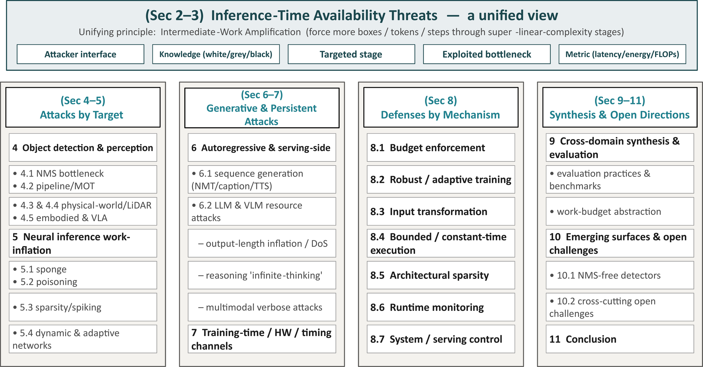
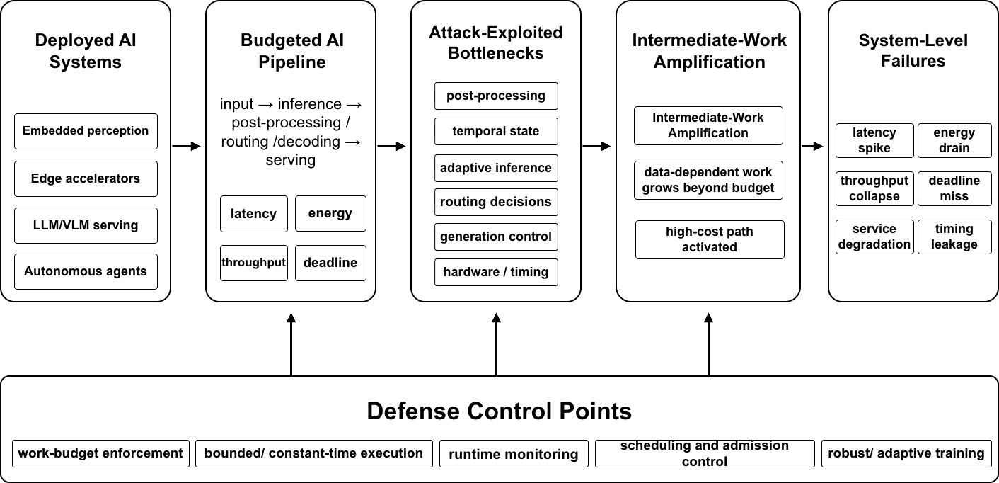

# Awesome Deep Learning Latency Attacks &amp; Defenses [](https://awesome.re) [](./LICENSE)

<p align="center">
  <a href="https://guzonghua.github.io/awesome-latency-attacks/">
    
  </a>
</p>

This repository is maintained as a companion resource for the survey *“Deep Learning Latency Attacks and Defenses: A Cross-Domain Survey.”* It indexes papers, code links, taxonomy notes, and figures on latency-oriented availability threats in deployed AI systems.

The list focuses on attacks and defenses that affect inference-time or system-level cost — latency, energy, throughput pressure, and deadline misses — rather than attacks that only change model predictions. It currently includes **110 works** (71 inference-stage attacks, 13 training-stage attacks, 26 defenses).

> Search and filter the catalog in the **[interactive table on GitHub Pages](https://guzonghua.github.io/awesome-latency-attacks/)**.

---

## Overview

<p align="center"><b>Figure 1.</b> Overview of the survey structure.</p>

<div align="center"></div>

<p align="center"><b>Figure 2.</b> Latency attacks as system-level availability threats.</p>

<div align="center"></div>

Latency attacks are **availability** attacks: rather than corrupting a prediction, the adversary inflates the inference-time computation, energy, or wall-clock latency of a model so a real-time consumer (a vehicle controller, an interactive service, a battery-powered sensor) misses its deadline or exhausts its resources — often while the prediction itself remains nominally correct. It connects deployed AI systems, attack-exploited bottlenecks, intermediate-work amplification, system-level failures, and defense control points.

Every attack family shares one mechanism we call **intermediate-work amplification**: the adversary forces some downstream stage (NMS, self-attention, autoregressive decoding, expert routing) to process more intermediate objects, tokens, or steps than a benign input would generate. Because those stages have super-linear worst-case complexity, a modest increase in count produces a disproportionate cost increase. The natural cross-domain defense is a **work budget** — an enforced cap on intermediate objects/tokens per unit time.

---

## Inference-Stage Attacks

|Attack | Venue | Target | Domain | Setting | Paper :page_facing_up: | Code |
| :--- | :---: | :---: | :---: | :---: | :---: | :---: |
| Daedalus | arXiv (2019) | Object detection (NMS) | CV / AD | White box (physical) | [paper](https://arxiv.org/abs/1902.02067) | [GitHub](https://github.com/NeuralSec/Daedalus-attack) |
| Sparsity Attacks | IEEE TCAD (2020) | CNNs | CV | White box | [paper](https://arxiv.org/abs/2006.08020) | ✘ |
| ILFO | CVPR (2020) | Depth-adaptive networks (AdNNs) | CV | White box | [paper](https://youngwei.com/pdf/ILFO.pdf) | ✘ |
| Sponge Examples | EuroS&P (2021) | Transformers + CNNs | CV & NLP | Black & white box | [paper](https://arxiv.org/abs/2006.03463) | [GitHub](https://github.com/iliaishacked/sponge_examples) |
| DeepSloth | ICLR (2021) | Multi-exit CNNs | CV | White box | [paper](https://arxiv.org/abs/2010.02432) | [GitHub](https://github.com/Sanghyun-Hong/DeepSloth) |
| Timing Side-Channel AE | IEICE Trans. (2021) | DNN classifiers (timing oracle) | CV | Black box (timing) | [paper](https://doi.org/10.1587/transfun.2020CIP0022) | ✘ |
| SpikeAttack | ACM/IEEE DAC (2022) | Spiking neural networks | CV | White box | [paper](https://dl.acm.org/doi/pdf/10.1145/3489517.3530443) | ✘ |
| NMTSloth | ESEC/FSE (2022) | Decoder-based NMT | NLP | White box | [paper](https://arxiv.org/abs/2210.03696v1) | [GitHub](https://github.com/SeekingDream/FSE22_NMTSloth) |
| LLMEffiChecker | ACM TOSEM (2022) | LLMs | NLP | Black & white box | [paper](https://dl.acm.org/doi/full/10.1145/3664812) | [GitHub](https://github.com/Cap-Ning/LLMEffiChecker) |
| NICGSlowDown | CVPR (2022) | Decoder-based image captioning | CV | White box | [paper](https://arxiv.org/abs/2203.15859) | [GitHub](https://github.com/SeekingDream/CVPR22_NICGSlowDown) |
| GradAuto | ECCV (2022) | Dynamic neural networks (depth/width AdNNs) | CV | White box | [paper](https://doi.org/10.1007/978-3-031-19772-7_37) | [GitHub](https://github.com/JianhongPan/GradAuto) |
| EREBA | ICSE (2022) | Adaptive neural networks | CV | Black box | [paper](https://doi.org/10.1145/3510003.3510088) | ✘ |
| DeepPerform | ASE (2022) | Dynamic (resource-constrained) DNNs | CV / NLP | White box (testing) | [paper](https://arxiv.org/abs/2210.05370) | ✘ |
| DDAS | GLOBECOM (2022) | Edge dynamic (multi-exit) DNNs | CV | White box | [paper](https://doi.org/10.1109/GLOBECOM48099.2022.10001235) | ✘ |
| SAME | ACL (2023) | Multi-exit transformers | NLP | White box | [paper](https://arxiv.org/abs/2305.12228) | [GitHub](https://github.com/MatthewCYM/SAME) |
| SlowBERT | ACL Findings (2023) | Multi-exit BERT | NLP | White box | [paper](https://aclanthology.org/2023.findings-acl.634/) | ✘ |
| No-Skim | arXiv (2023) | Skimming language models | NLP | Black & white box | [paper](https://arxiv.org/abs/2312.09494) | ✘ |
| Phantom Sponges | WACV (2023) | Object detection (NMS) | CV / AD | White box | [paper](https://arxiv.org/abs/2205.13618) | [GitHub](https://github.com/AvishagS422/PhantomSponges) |
| SlowLiDAR | CVPR (2023) | 3D LiDAR detection | CV / AD | White box | [paper](https://openaccess.thecvf.com/content/CVPR2023/papers/Liu_SlowLiDAR_Increasing_the_Latency_of_LiDAR-Based_Detection_Using_Adversarial_Examples_CVPR_2023_paper.pdf) | [GitHub](https://github.com/WUSTL-CSPL/SlowLiDAR) |
| Variable-Time Inference | AISec@CCS (2023) | Object detection (NMS timing) | CV | Black box (timing) | [paper](https://doi.org/10.1145/3605764.3623912) | ✘ |
| AntiNODE | ICCVW (2023) | Neural ODEs | CV | White & black box | [paper](https://doi.org/10.1109/ICCVW60793.2023.00163) | ✘ |
| GradMDM | IEEE TPAMI (2023) | Dynamic neural networks | CV | White box | [paper](https://arxiv.org/abs/2304.06724) | ✘ |
| SlothSpeech | INTERSPEECH (2023) | Speech recognition (ASR) | Speech | White box | [paper](https://www.isca-archive.org/interspeech_2023/haque23_interspeech.pdf) | ✘ |
| WAFFLE | NeurIPS (2023) | Multi-exit language models | NLP | White & black box | [paper](https://arxiv.org/abs/2310.19152) | [GitHub](https://github.com/ZachCoalson/WAFFLE) |
| Overload | CVPR (2024) | Object detection (edge) | CV / AD | White box | [paper](https://arxiv.org/abs/2304.05370) | ✘ |
| Beyond PhantomSponges | ACM WiseML (2024) | Object detection (NMS) | CV / AD | White box | [paper](https://doi.org/10.1145/3649403.3656485) | ✘ |
| SlowTrack | AAAI (2024) | Camera perception (detect+track) | AD | White box | [paper](https://arxiv.org/abs/2312.09520) | [GitHub](https://github.com/eaiers/SlowTrack) |
| SlowPerception | arXiv (2024) | Camera perception (NMS+MOT) | AD | White box (physical, projector) | [paper](https://arxiv.org/abs/2406.05800) | ✘ |
| Steal Now Attack Later | arXiv (2024) | Object detection | CV | Black box | [paper](https://arxiv.org/abs/2404.15881) | ✘ |
| Energy Attack (multi-exit) | Info. & Software Tech. (2024) | Adaptive multi-exit networks | CV | Grey box | [paper](https://doi.org/10.1016/j.infsof.2024.107653) | ✘ |
| Slowdown Causes (SaTML) | IEEE SaTML (2024) | Language models | NLP | White box | [paper](https://arxiv.org/abs/2305.18926) | ✘ |
| Engorgio | arXiv (2024) | LLMs (output inflation) | NLP | White box + transfer | [paper](https://arxiv.org/abs/2412.19394) | [GitHub](https://github.com/jianshuod/Engorgio-prompt) |
| Verbose Images | ICLR (2024) | Large VLMs | CV+NLP | White box | [paper](https://arxiv.org/abs/2401.11170) | [GitHub](https://github.com/KuofengGao/Verbose_Images) |
| Uniform Inputs | IEEE SPW (2024) | CNNs (sparsity) | CV | Black box | [paper](https://arxiv.org/abs/2403.18587) | [GitHub](https://github.com/and-mill/2024-sponge-example-analysis) |
| SlowFormer | CVPR (2024) | Efficient vision transformers | CV | White box (patch) | [paper](https://arxiv.org/abs/2310.02544) | [GitHub](https://github.com/UCDvision/SlowFormer) |
| DeSparsify | NeurIPS (2024) | Token-sparsified ViTs | CV | White box | [paper](https://arxiv.org/abs/2402.02554) | ✘ |
| Speculative-Decoding Side Channel | arXiv (2024) | LLM serving (speculative decoding) | NLP | Black box (timing) | [paper](https://arxiv.org/abs/2411.01076) | ✘ |
| DetStorm | IEEE S&P (2025) | Camera perception | AD | White box (physical) | [paper](https://doi.org/10.1109/SP61157.2025.00236) | ✘ |
| Inference-Time Impact Analysis | arXiv (2025) | Full perception (sim.) | AD | Simulation | [paper](https://arxiv.org/abs/2505.03850) | ✘ |
| DDLS Efficiency Attacks | arXiv (2025) | Early-exit / token-pruning / MoE | CV & NLP | White & black box | [paper](https://arxiv.org/abs/2506.17621) | ✘ |
| TTSlow | IEEE TASLP (2025) | Auto-regressive TTS | Speech | White box | [paper](https://arxiv.org/abs/2407.01927) | ✘ |
| Crabs/AutoDoS | ACL (2025) | LLMs (DoS) | NLP | Black box | [paper](https://aclanthology.org/2025.findings-acl.580/) | [GitHub](https://github.com/shuita2333/AutoDoS) |
| VLMInferSlow | ACL (2025) | VLMs-as-a-service | CV+NLP | Black box | [paper](https://aclanthology.org/2025.acl-long.encyclopedia/) | ✘ |
| Verbose-Text Induction | arXiv (2025) | VLMs | CV+NLP | White box | [paper](https://arxiv.org/abs/2511.16163) | ✘ |
| LingoLoop | arXiv (2025) | Multimodal LLMs | CV+NLP | White box | [paper](https://arxiv.org/abs/2506.14493) | ✘ |
| Bit-Flip NMS Attack | WACV (2025) | Object detection (parameters) | CV / AD | Hardware (Rowhammer) | [paper](https://doi.org/10.1109/WACV61041.2025.00653) | ✘ |
| Timestep-Compressed Attack | AAAI (2025) | Spiking neural networks | CV | White box | [paper](https://arxiv.org/abs/2508.13812) | ✘ |
| QuantAttack | WACV (2025) | Dynamically quantized ViTs | CV | White box | [paper](https://arxiv.org/abs/2312.02220) | [GitHub](https://github.com/barasamit/QuantAttack) |
| RepetitionCurse | arXiv (2025) | MoE LLMs (expert parallelism) | NLP | Black box | [paper](https://arxiv.org/abs/2512.23995) | ✘ |
| FreezeVLA | arXiv (2025) | Vision-language-action models | Robotics | White box (image) | [paper](https://arxiv.org/abs/2509.19870) | ✘ |
| EDPA | arXiv (2025) | Vision-language-action models | Robotics | Black box (patch) | [paper](https://arxiv.org/abs/2510.13237) | [GitHub](https://edpa-attack.github.io/) |
| ANNIE | arXiv (2025) | Embodied AI / VLA robots | Robotics | White box | [paper](https://arxiv.org/abs/2509.03383) | [GitHub](https://github.com/RLCLab/Annie) |
| OverThink | arXiv (2025) | Reasoning LLMs | NLP | Black box (prompt) | [paper](https://arxiv.org/abs/2502.02542) | ✘ |
| ExtendAttack | arXiv (2025) | Large reasoning models | NLP | Black box (encoding) | [paper](https://arxiv.org/abs/2506.13737) | ✘ |
| EVADE (NMS Realism Study) | NeurIPS (2025) | NMS latency attacks (critical re-evaluation) | CV / AD | Critical evaluation (4 attacks, 7 platforms, 15 models) | [paper](https://proceedings.neurips.cc/paper_files/paper/2025/file/371713c3e5314dff9483c62c5abb98a8-Paper-Conference.pdf) | ✘ |
| CP-FREEZER | AAAI (2026) | Cooperative perception (V2V) | AD | White box (testbed) | [paper](https://ojs.aaai.org/index.php/AAAI/article/download/37082/41044) | ✘ |
| SPLAT | IEEE TCAD (2026) | Multi-exit dynamic networks | CV | Black box | [paper](https://doi.org/10.1109/TCAD.2025.3576320) | ✘ |
| RouteHijack | arXiv (2026) | Mixture-of-experts LLMs | NLP | White box | [paper](https://arxiv.org/abs/2605.02946) | ✘ |
| Misrouter | arXiv (2026) | Mixture-of-experts LLMs | NLP | Black box (input-only) | [paper](https://arxiv.org/abs/2605.04446) | ✘ |
| ReasoningBomb | ACM CCS (2026) | Large reasoning models | NLP | Black box | [paper](https://arxiv.org/abs/2602.00154) | ✘ |
| ThinkTrap | NDSS (2026) | Reasoning LLM APIs | NLP | Black box | [paper](https://www.ndss-symposium.org/ndss2026/) | ✘ |
| VidDoS | arXiv (2026) | Video-LLMs (streaming AD) | CV+NLP / AD | White box (universal patch) | [paper](https://arxiv.org/abs/2603.01454) | ✘ |
| Semantic-DoS | arXiv (2026) | LLM-controlled robots | Robotics | Audio injection | [paper](https://arxiv.org/abs/2604.24790) | ✘ |
| MAVLA | ACM WWW (2026) | Vision-language-action models | Robotics | White box | [paper](https://doi.org/10.1145/3774904.3792315) | ✘ |
| Fill and Squeeze | arXiv (2026) | LLM serving scheduler | NLP | Black box (system) | [paper](https://arxiv.org/abs/2602.07878) | ✘ |
| Beyond Max Tokens | arXiv (2026) | LLM agent tool chains (MCP) | NLP / Agentic | Black box | [paper](https://arxiv.org/abs/2601.10955) | ✘ |
| From Shield to Target | arXiv (2026) | LLM agent guardrails | NLP / Agentic | Black box (transfer) | [paper](https://arxiv.org/abs/2606.14517) | ✘ |
| Mobius Injection (AbO-DDoS) | arXiv (2026) | LLM agent infrastructure | Agentic | Injection | [paper](https://arxiv.org/abs/2605.11442) | ✘ |
| Groundswell | VehicleSec (2026) | Object detection (camera NMS) | CV / AD | Physical (white box) | [paper](https://www.usenix.org/conference/vehiclesec26) | ✘ |
| LoopLLM | AAAI (2026) | LLMs (repetitive generation) | NLP | White box + transfer | [paper](https://arxiv.org/abs/2511.07876) | ✘ |
| CORBA | ACL Findings (2026) | LLM multi-agent systems | Agentic | Contagious injection | [paper](https://arxiv.org/abs/2502.14529) | [GitHub](https://github.com/zhrli324/Corba) |

---

## Training-Stage Attacks

|Attack | Venue | Target | Domain | Setting | Paper :page_facing_up: | Code |
| :--- | :---: | :---: | :---: | :---: | :---: | :---: |
| On-Device Sponge Poisoning | ACM SecTL (2023) | On-device DNNs | CV | Partial control | [paper](https://doi.org/10.1145/3591197.3591307) | ✘ |
| Mobile-App Sponge | ACM HotMobile (2023) | Mobile ML models | CV | Partial control | [paper](https://doi.org/10.1145/3572864.3581586) | ✘ |
| SkipSponge | arXiv (2024) | CNNs, GANs (weights) | CV | Full control | [paper](https://arxiv.org/abs/2402.06357) | ✘ |
| Huang et al. (multi-exit) | IEEE Access (2024) | Multi-exit CNNs | CV | Full control | [paper](https://doi.org/10.1109/ACCESS.2024.3370849) | ✘ |
| Sponge Backdoor (OD) | IJCNN (2024) | Object detection (NMS) | CV / AD | Backdoor | [paper](https://doi.org/10.1109/IJCNN60899.2024.10650435) | ✘ |
| DoS Poisoning (LLM) | arXiv (2024) | LLMs (no-EOS) | NLP | Backdoor / poisoning | [paper](https://arxiv.org/abs/2410.10760) | [GitHub](https://github.com/sail-sg/P-DoS) |
| Sponge Poisoning | Information Sciences (2025) | CNNs | CV | Partial control | [paper](https://doi.org/10.1016/j.ins.2025.121905) | [GitHub](https://github.com/Cinofix/sponge_poisoning_energy_latency_attack) |
| Sensing-AI Sponge | IEEE GLOBECOM (2025) | Sensing DNNs (IoT) | Sensing | Partial control | [paper](https://doi.org/10.1109/GLOBECOM59602.2025.11432163) | ✘ |
| EvoWeight (FPGA) | IEEE HOST (2025) | FPGA DNN accelerators | CV | Full control | [paper](https://doi.org/10.1109/HOST64725.2025.11050058) | ✘ |
| Reflection Backdoor (VLM-AD) | arXiv (2025) | Driving VLM planner | AD | Backdoor (physical trigger) | [paper](https://arxiv.org/abs/2505.06413) | ✘ |
| BitHydra | arXiv (2025) | LLM weights (no-EOS) | NLP | Hardware (bit-flip) | [paper](https://arxiv.org/abs/2505.16670) | ✘ |
| DrainCode | arXiv (2026) | RAG code generation | NLP / Code | Corpus poisoning | [paper](https://arxiv.org/abs/2601.20615) | [GitHub](https://github.com/DeepSoftwareAnalytics/DrainCode) |
| RA-ICA (RAG) | ACM WWW (2026) | RAG-enhanced LLMs | NLP | Corpus poisoning | [paper](https://arxiv.org/abs/2606.02643) | ✘ |

---

## Defenses

|Defense | Venue | Target | Mechanism | Domain | Paper :page_facing_up: | Code |
| :--- | :---: | :---: | :---: | :---: | :---: | :---: |
| Feature Distillation | CVPR (2019) | DNN classifiers (JPEG/DCT) | Input transformation | CV | [paper](https://doi.org/10.1109/CVPR.2019.00095) | ✘ |
| DEE Scheduling | ACM CIKM (2021) | Early-exit networks | Runtime scheduling | CV | [paper](https://doi.org/10.1145/3459637.3482335) | ✘ |
| Certifier Caveat | arXiv (2021) | Certified classifiers | Defense pitfall | CV | [paper](https://arxiv.org/abs/2108.11299) | ✘ |
| Constant-Time NMS | AISec@CCS (2023) | Object detection (NMS) | Bounded execution | CV | [paper](https://doi.org/10.1145/3605764.3623912) | ✘ |
| PSML | arXiv (2023) | Inference serving systems | System / serving control | ML serving | [paper](https://arxiv.org/abs/2307.01292) | ✘ |
| DefQ | IEEE IoT-J (2023) | Multi-exit DNNs (edge) | Input transformation | CV | [paper](https://doi.org/10.1109/JIOT.2021.3138935) | ✘ |
| Adaptive Resizing | ACM WiseML (2024) | Object detection (NMS) | Input transformation | AD | [paper](https://doi.org/10.1145/3649403.3656485) | ✘ |
| ADAV Patch Defense | arXiv (2024) | Object detection | Input transformation | AD | [paper](https://arxiv.org/abs/2412.06215) | ✘ |
| Securing AV Perception | IEEE TIV (2024) | AV visual perception | Input transformation | AD | [paper](https://doi.org/10.1109/TIV.2024.3403667) | ✘ |
| Calibration Defense | IEEE SaTML (2024) | Multi-exit models | Robust training | NLP | [paper](https://arxiv.org/abs/2305.18926) | ✘ |
| Sparsity Monitor | IEEE SPW (2024) | CNNs | Runtime monitoring | CV | [paper](https://arxiv.org/abs/2403.18587) | [GitHub](https://github.com/and-mill/2024-sponge-example-analysis) |
| Garrison | ACM/IEEE DAC (2024) | Ensemble inference (GPU) | System / serving control | CV | [paper](https://doi.org/10.1145/3649329.3654810) | ✘ |
| Time-Traveling Defense | arXiv (2024) | Traffic-sign classifiers | Temporal redundancy | AD | [paper](https://arxiv.org/abs/2410.08338) | ✘ |
| TALE (Token-Budget Reasoning) | arXiv (2024) | Reasoning LLMs (prompt budget) | Budget enforcement | NLP | [paper](https://arxiv.org/abs/2412.18547) | [GitHub](https://github.com/GeniusHTX/TALE) |
| Concise CoT (CCoT) | arXiv (2024) | Reasoning LLMs (prompt concision) | Budget enforcement | NLP | [paper](https://arxiv.org/abs/2401.05618) | [GitHub](https://github.com/matthewrenze/jhu-concise-cot) |
| Can't Slow Me Down | CVPR (2025) | Edge object detectors | Robust/adaptive training | AD | [paper](https://doi.org/10.1109/CVPR52734.2025.01791) | [GitHub](https://github.com/Hill-Wu1998/underload) |
| DCT Patch Elimination | IEEE RCAR (2025) | Object detection | Input transformation | AD | [paper](https://doi.org/10.1109/RCAR65431.2025.11139457) | ✘ |
| Real-Time LiDAR Defense | ACM CCS (2025) | LiDAR detection | Runtime monitoring | AD | [paper](https://doi.org/10.1145/3719027.3765227) | ✘ |
| LDP Purification | IEEE TrustCom (2025) | VLM visual encoders | Input purification | CV+NLP | [paper](https://doi.org/10.1109/Trustcom66490.2025.00065) | ✘ |
| Pruning Defense | IEEE GLOBECOM (2025) | Sensing DNNs | Architectural sparsity | Sensing | [paper](https://doi.org/10.1109/GLOBECOM59602.2025.11432163) | ✘ |
| BlindSight | arXiv (2025) | VLMs | Architectural sparsity | CV+NLP | [paper](https://arxiv.org/abs/2507.09071) | ✘ |
| PD3F | EMNLP (2025) | LLM serving | Budget enforcement | NLP | [paper](https://arxiv.org/abs/2505.18680) | ✘ |
| CoT-Valve | ACL (2025) | Reasoning LLMs (length control) | Budget enforcement | NLP | [paper](https://aclanthology.org/2025.acl-long.300/) | [GitHub](https://github.com/horseee/CoT-Valve) |
| SQUAD | arXiv (2026) | Early-exit ensembles | Runtime scheduling | CV | [paper](https://arxiv.org/abs/2601.22711) | ✘ |
| Token-Budget Routing | arXiv (2026) | LLM serving | Budget enforcement | NLP | ✘ | ✘ |
| Conformal Thinking | arXiv (2026) | Reasoning models | Budget enforcement | NLP | [paper](https://arxiv.org/abs/2602.03814) | ✘ |

---

## Citation

If you find this resource useful, please cite the survey:

```bibtex
@article{gu2026latencysurvey,
  title   = {Deep Learning Latency Attacks and Defenses: A Cross-Domain Survey},
  author  = {Gu, Zonghua and Gao, Zeyu and Saremi, Amin and Chakraborty, Samarjit},
  journal = {under review},
  year    = {2026}
}
```

---

*Legend:* ✘ = no public code located. Code links are included when an official repository or project page has been identified. Found a broken link or missing paper? [Open an issue](../../issues).
